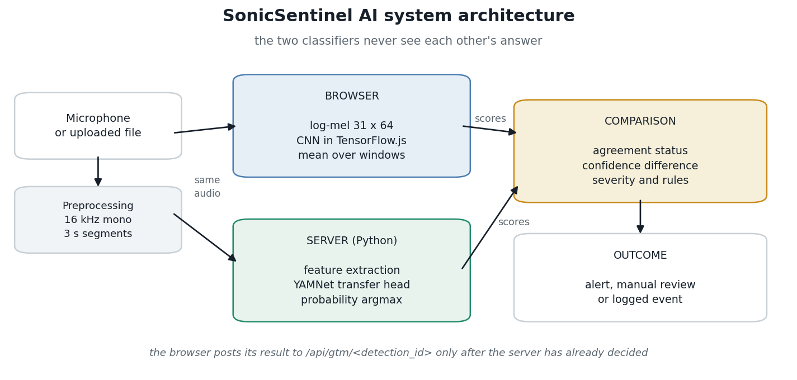
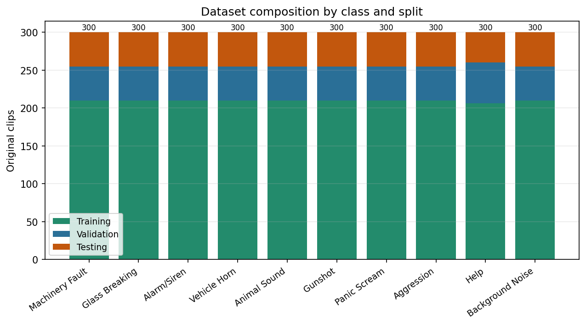
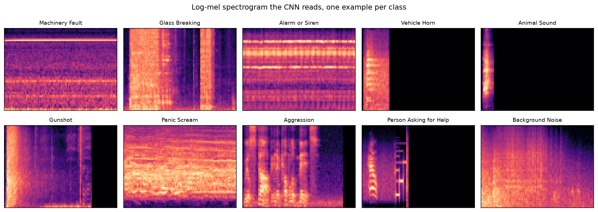
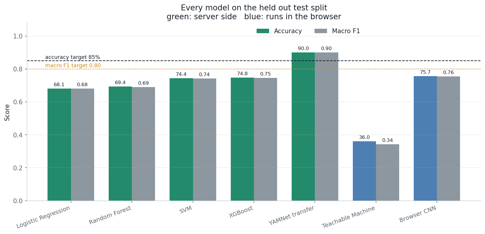
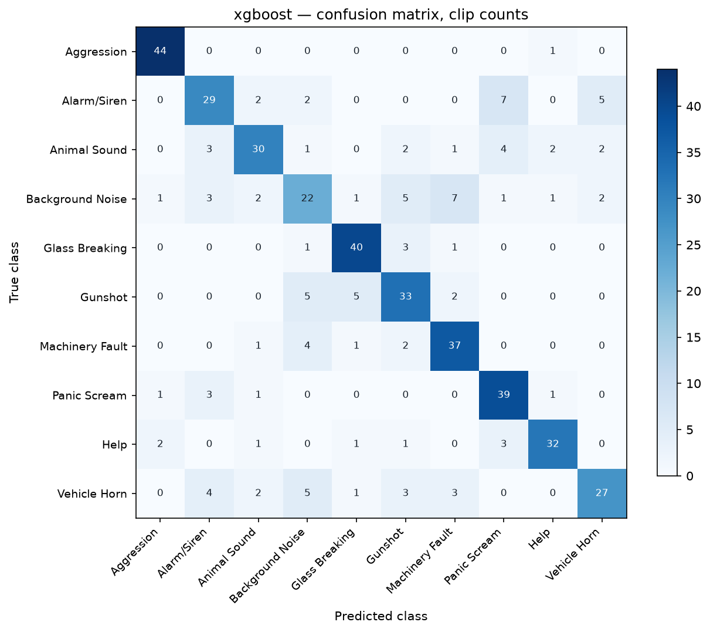
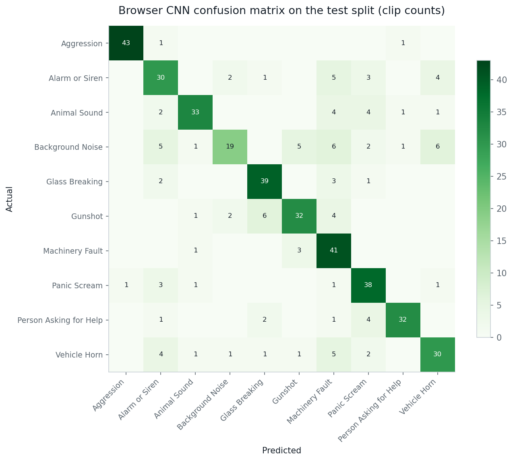

# Building SonicSentinel AI: Lessons from Sound Event Detection

**Project team:** Moiz Jan, Sarim Owais, Ibad, Muhammad Hamza, Zarwasham Lodhi and Alishba  
**Mentor:** Sir Hamza Ali

Sound can carry an important warning before anyone sees a problem. A machine may begin to fail in a place where no camera can see it. Glass may break in another room. An alarm, a horn, a scream or a call for help may be difficult to hear in a crowded space. People who monitor sound by listening all day can become tired, miss events or respond late.

SonicSentinel AI is a student project that explores how software can help with this work. A user can upload an audio recording or allow the browser to use a microphone. The application analyzes short sound windows, shows results from two separate classifiers, applies event rules, and records detections for later review. It is a prototype for controlled and ethical testing. It is not a certified emergency response system, and its alerts should not replace human judgment.

The project follows the goals in its Software Requirements Specification (SRS), including ten sound classes, uploaded and live audio, model comparison, alerts, event history and manual review. The implementation also has gaps against the SRS. This article explains what works, what the measurements say, and what still needs to change.

## Why sound monitoring is difficult

Sound monitoring is useful in factories, public buildings, transport areas, farms, homes and other settings. The same sound can mean different things in different places. A loud impact might be a dropped object, a door, a firework or a gunshot. A person raising their voice might be speaking over traffic or asking for help. A machine can sound normal in one operating state and faulty in another.

Background noise makes these differences harder to judge. Microphone quality, distance, echo, room size and the position of a sound source all affect a recording. Events can overlap. A short event can also fall across the edge of an analysis window and lose useful context.

SonicSentinel aims to help a person notice and review events. The model produces a category and confidence scores. The application adds audio quality checks, configurable alert rules and a manual review path. A score is evidence for a decision, not proof that an event happened.

## What the application does

The application is a Flask web app. It supports audio uploads, including batch uploads, and live microphone monitoring after the user grants permission. The server checks incoming audio, reads its metadata, converts it for analysis, and divides it into short windows. The browser and server each run their own classifier on the audio. The server does not pass its prediction to the browser model. Their results are compared after they have been produced independently.

The interface can show the two predicted classes and their scores, whether they agree, audio quality, severity, alert status and the recommended next action. It can also display a waveform and spectrogram. Users can search event history, acknowledge or escalate alerts, and send uncertain or conflicting results to manual review. Reviewers can listen to a clip, record a decision and add a comment. The original model results remain available after review.

The application has user roles, including normal users, reviewers, operators, maintenance users and administrators. Administrators can adjust thresholds and retention settings, review alert rules and inspect the audit trail. These features matter because model output alone cannot provide a complete safety workflow.

*Figure 1. Project architecture diagram. It summarizes the application components; it is not a performance result.*

## Building a shared dataset

The SRS calls for at least 3,000 unique original recordings, with roughly 300 for each of ten required classes: Machinery Fault, Glass Breaking, Alarm or Siren, Vehicle Horn, Animal Sound, Gunshot, Panic Scream, Aggression, Person Asking for Help and Background Noise. The project contains 3,000 original clips. The split folders have 2,096 training clips, 459 validation clips and 445 test clips. These counts differ slightly from the SRS target of 2,100, 450 and 450 because the split process keeps related recordings together.

Keeping related material in one split is important. If two segments from the same recording appeared in both training and testing, a model could recognize recording details rather than the sound category. The dataset preparation process uses recording or speaker grouping when metadata allows it, then creates stratified splits. Derived segments and training augmentations should stay with their original recording and must not be counted as new original clips.

The SRS also asks teams to record information such as source, duration, sample rate, channels, recording environment, device, distance, speaker or recording ID, augmentation status and split. The project includes dataset metadata fields for these details. Coverage is not complete for every clip, so the project cannot claim that all environments, devices or distances are represented. Better source records would make the evaluation easier to interpret and would help identify gaps.

Safety-related audio needs careful handling. Help phrases should be collected with consent, generated synthetically where allowed, or obtained from ethically licensed sources. Recordings of violence, emergencies or identifiable speech can be sensitive. The team should avoid collecting real emergencies without consent, restrict access to recordings, document licenses and remove material when retention rules require it. Dataset balance matters too: a collection dominated by a few voices, devices or rooms can perform poorly for people and places it rarely heard during training.

*Figure 2. The project dataset distribution plot. It describes the available clips, not how diverse every class is.*

## Preparing audio for models

Audio files can use different formats, sample rates, channel counts and volumes. Before analysis, the application validates the file and checks that it can be decoded and contains a usable signal. The processing path converts audio to a consistent mono signal and sample rate, normalizes its level, handles silence and prepares fixed-duration windows. Invalid, silent or unusable audio should receive a clear message rather than a misleading prediction.

A waveform shows how the signal amplitude changes over time. A spectrogram shows how energy is spread across frequency bands over time. These views help users understand what was recorded, but they do not decide the class by themselves. They can reveal silence, clipping, repeated bursts or noisy regions that deserve a closer look.

*Figure 3. This is an illustrative example from the [TorchAudio feature extraction tutorial](https://docs.pytorch.org/audio/2.9.0/tutorials/audio_feature_extractions_tutorial.html), not an image produced by SonicSentinel.*

The Python model uses a feature vector with 215 values. The feature pipeline is intended to summarize patterns such as energy, frequency balance and changes over time. The browser CNN uses log-mel spectrogram windows. A log-mel view groups frequencies into bands that are useful for audio classification and gives the convolutional network a compact time-frequency pattern to learn from.

*Figure 4. Example spectrograms generated from project audio. Patterns can differ by class, but similar sounds and noisy recordings can still overlap.*

## Comparing the Python models

The team compared Logistic Regression, Random Forest, Support Vector Machine and XGBoost on the same held-out test split. Hyperparameters were selected using validation data. The model comparison included accuracy, precision, recall, F1, macro F1, class-wise performance and confusion matrices. Macro F1 gives each class equal weight, which helps show whether a model is neglecting smaller or difficult classes.

| Python model | Test accuracy | Macro F1 |
| --- | ---: | ---: |
| Logistic Regression | 68.09% | 0.6812 |
| Random Forest | 69.44% | 0.6904 |
| Support Vector Machine | 74.38% | 0.7424 |
| XGBoost | 74.83% | 0.7455 |
| YAMNet transfer candidate | 90.02% | 0.9000 |

XGBoost is the configured Python model in the application. The YAMNet transfer candidate performed better in a saved evaluation, but it is an experiment and is not the model currently selected for the application. That evaluation used 451 segments from 445 recordings, so its score should not be compared as if it were exactly the same recording-level test. A stronger candidate still needs integration, repeatable evaluation and review before it can be treated as the deployed model.

The SRS sets targets of 85% accuracy and 0.80 macro F1 for both models. XGBoost scores 74.83% accuracy and 0.7455 macro F1, so it misses both targets. Its critical-class recall is uneven: Aggression is 97.78%, Glass Breaking is 88.89%, Panic Scream is 86.67%, Person Asking for Help is 80.00%, and Gunshot is 73.33%. Overall accuracy hides these important differences.

*Figure 5. Saved model comparison results. The YAMNet result is a candidate evaluation, not proof that the current application meets its model targets.*

*Figure 6. XGBoost confusion matrix on the test evaluation. The off-diagonal cells show which classes the model confused.*

## The browser model and the SRS gap

The SRS specifically asks for a Google Teachable Machine (GTM) audio model alongside the Python model. Early project work tested Teachable Machine exports. The final browser artifact in the repository is instead a project-trained convolutional neural network that uses log-mel features and TensorFlow.js. It runs independently in the browser and does not receive the Python model's prediction. This is a useful browser-model experiment, but it does not satisfy the SRS requirement to use Teachable Machine. The project should either restore and validate a compliant GTM model or seek an approved change to the requirement before claiming full SRS compliance.

The browser CNN's saved test evaluation is 75.73% accuracy and 0.7555 macro F1 across 445 recordings. It is substantially stronger than the saved Teachable Machine experiment results in the earlier draft, but it remains below the SRS goals of 85% accuracy and 0.80 macro F1. Its weakest recall is Background Noise at about 42%. Machinery Fault is also often predicted too readily. These errors can create false alerts and reduce trust in the system.

The CNN uses 1-second windows at 16 kHz. Each window is padded to 16,384 samples, converted to a 31 by 64 log-mel feature map, and normalized. The same feature settings are implemented in Python and JavaScript. A parity check compared both implementations: the worst CPU mean absolute difference was 0.000037 with correlation 1.000000; the worst WebGL mean absolute difference was 0.0017 with correlation 0.999976. These checks help show that the browser and training feature pipelines agree numerically. They do not prove that the classifier is accurate on new environments.

Mean probability across windows was chosen using the validation set. On validation, mean aggregation reached 82.14% accuracy and 0.8153 macro F1, ahead of max-over-window and top-three-window alternatives. The final test result was lower. We kept the validation choice instead of switching methods after seeing the test result. Test data is most useful when it stays untouched until the final evaluation.

*Figure 7. Browser CNN confusion matrix. Frequent confusions can point to missing data, overlapping sound patterns or weaknesses in the current features.*

## Confidence comparison and alerts

Both models produce class scores. The application compares the top predicted classes, whether they match, the difference between their top scores and the margin between the leading and second-place classes. A high score is not automatically a reliable result, and two models can agree for the wrong reason. Audio quality, repeated detections and class-specific alert rules provide additional context.

The alert system can assign severity such as informational, low, medium, high or critical. For example, a machinery fault may call for a maintenance check, while a gunshot prediction may require a critical alert only after configured conditions are met. Background noise is usually non-critical. Rules can also require repeated detections, a minimum confidence, enough separation from the next class, acceptable audio quality or model agreement. Uncertain events can be routed to a person instead of being treated as confirmed.

The system records event information such as the audio ID, metadata, model predictions and scores, quality result, severity, alert state, reviewer decision and processing time. This gives a reviewer a way to understand what happened and allows administrators to audit decisions. A final application action should include the predicted category, agreement status, confidence level, severity, alert status, recommended action and whether manual review is needed.

A false positive happens when the system raises an alert for the wrong sound. A false negative happens when a real critical sound is missed. Both matter. A high alert threshold may reduce false alarms but miss a quiet event. A low threshold may catch more events but overwhelm a reviewer. The right balance depends on the setting and should be measured with unseen recordings, not chosen by intuition alone.

## Noise, overlap and difficult examples

Noise robustness is not one score. It depends on the types of background sound, distance, echo, recording level, microphone and overlap used in testing. The project has saved noise-robustness plots for model experiments, but the available evidence does not represent every real environment. More tests should include low volume, clipping, echo, re-encoded files, partial events, different microphones, overlapping classes and distant sources, as listed in the SRS.

The current system uses short, fixed windows. That keeps inference practical, but a window can cut an event in half. A brief crash may be diluted by silence, while a long machine sound may change over time. Overlapping sounds can hide the patterns that distinguish a scream from shouting or an alarm from a horn. Longer context, overlapping windows and temporal smoothing may help, but each change needs validation because it can also delay alerts or increase false positives.

Model disagreement is a useful signal for review, not a reason to average the predictions and assume the answer is safe. The Python and browser classifiers were trained with different approaches. Their scores may not be calibrated in the same way. A confidence difference can therefore guide caution, but it is not a probability that one model is right. Review workflows preserve human judgment for uncertain cases.

## Security, privacy and responsible use

Microphone monitoring must be visible and permission-based. The application asks the browser for microphone access and displays monitoring status. It should not secretly record. Audio uploads and stored clips can contain personal or sensitive information, so teams should explain why a recording is collected, restrict access by role, protect credentials, configure retention and avoid sharing raw recordings without a lawful and ethical basis.

The prototype is intended for local or controlled evaluation. It has not been demonstrated to meet every production security, privacy, availability or scaling target in the SRS. Before real deployment, the team should test access controls, upload limits, file validation, database recovery, retention deletion, audit logs and concurrent use. Users should be told when model results are uncertain and when a human must review them.

SonicSentinel should not be used as the sole basis for emergency response, discipline, law enforcement or safety decisions. It does not identify a speaker or understand the full meaning of speech. It classifies sound patterns. A person must verify critical situations using the appropriate local process.

## What is complete and what is still a target

The repository includes a working web application, audio upload and live-monitor paths, audio features, two independent inference paths, a comparison screen, configurable alert behavior, event history, manual review, reporting and evaluation artifacts. The current saved XGBoost and browser CNN results are below the SRS accuracy and macro F1 targets. The browser CNN also differs from the GTM model named by the SRS.

Other SRS requirements need measured evidence before they can be claimed. The project has not established that a 30-second upload is always processed within eight seconds, that live predictions always arrive within three seconds, that the application can maintain 99% uptime, or that it can support 20,000 event records and multiple concurrent users without a meaningful slowdown. These are targets to test, not verified results. Testing should record the computer, audio length, number of users, response time, error rate and database size so others can reproduce the findings.

These gaps do not make the prototype useless. They define what the next work should measure. A model score is only one part of a dependable system. A reliable workflow also needs good data, clear limits, secure handling, understandable feedback and a human review path.

## Lessons and next steps

The first lesson is to build the dataset and its metadata together. If the team cannot trace a sample to its source, device, recording group and split, it becomes difficult to explain a result or find a bias. The next dataset round should broaden environments and devices, document consent and licenses, and collect more examples from the weakest classes, especially Background Noise and Gunshot.

The second lesson is to compare models on the same untouched recordings. Validation data can guide model choice and window aggregation. Test data should be used for the final report. Results should include confusion matrices and class-wise recall so that strong average scores do not hide a serious safety gap.

The third lesson is to test the exact model that users will run. A candidate model that scores well in a notebook is not automatically the browser or server model in the application. The saved model, feature code, class order, thresholds and aggregation policy must be versioned and checked together. For this project, the next model milestone should resolve the GTM requirement, verify independent inference, and re-run the comparison against the same unseen test recordings.

The fourth lesson is to measure the entire system. Model accuracy does not tell us how long preprocessing takes, whether alerts arrive on time, whether the database remains responsive, or how the application recovers from a failed model. Performance, security and availability tests should be recorded as carefully as classification results.

SonicSentinel AI is a useful working prototype and an honest starting point. It can turn audio into structured events and give people tools to review them. It does not yet meet every SRS target, and it should not be described as a finished safety product. Improving data coverage, resolving the Teachable Machine requirement, reducing missed critical sounds and benchmarking the application are the next steps toward a more dependable system.

